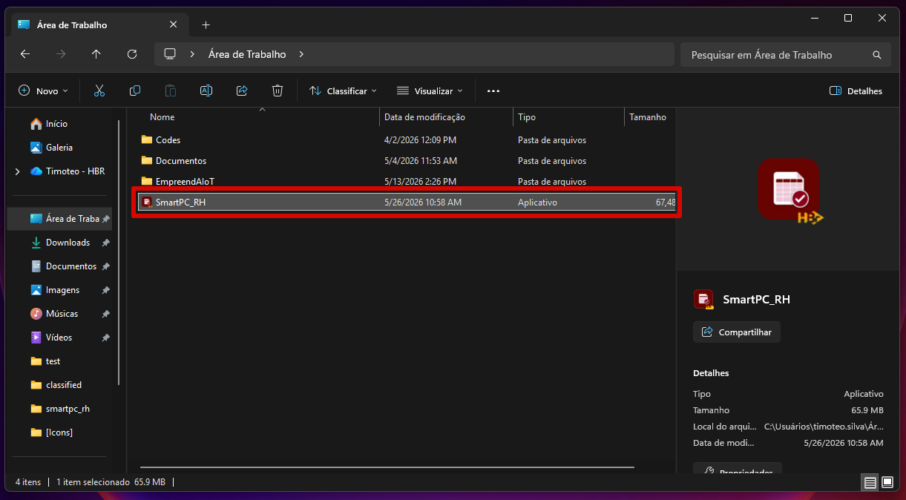
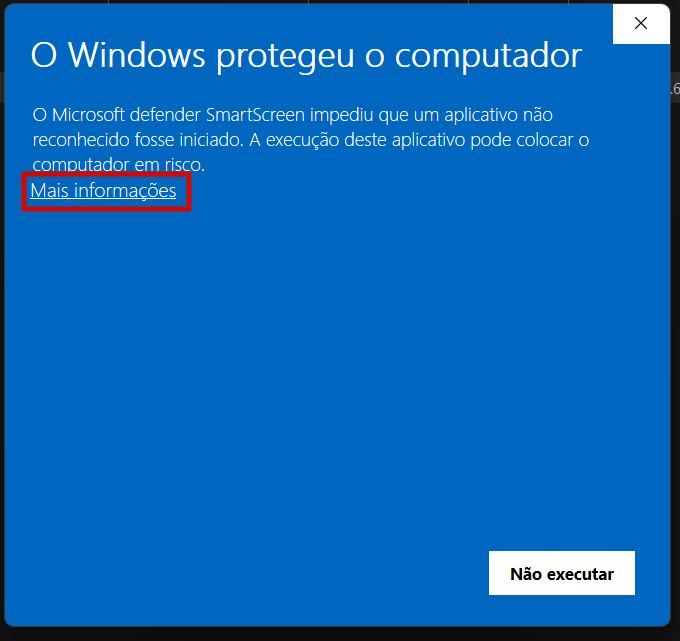
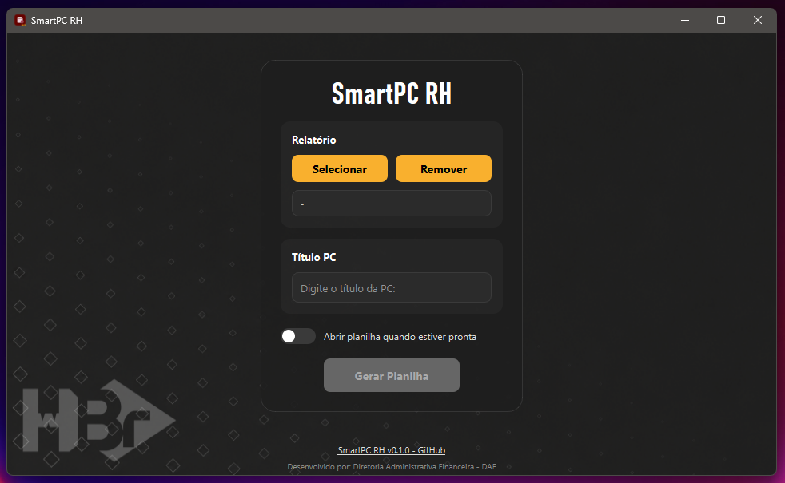
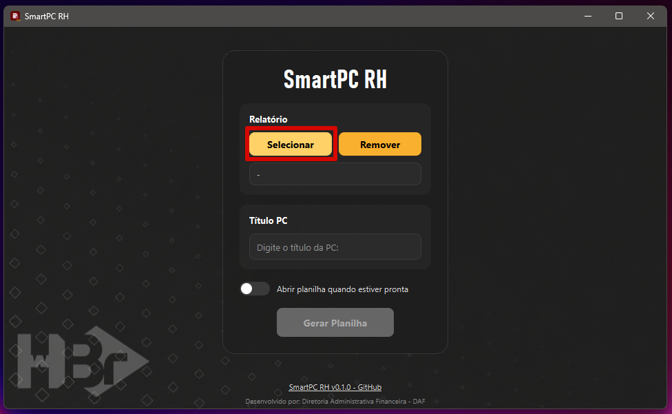
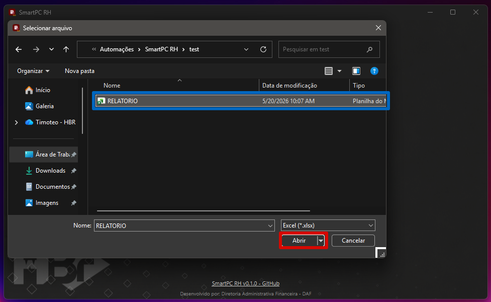
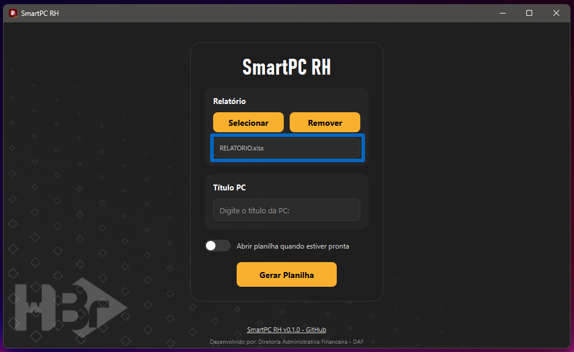
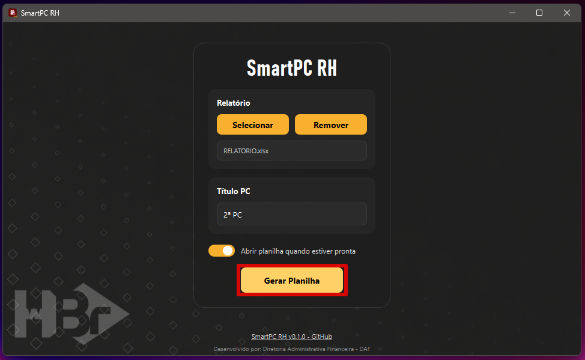
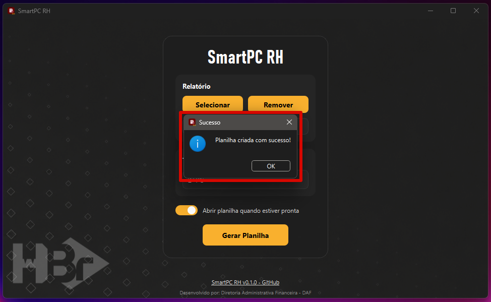
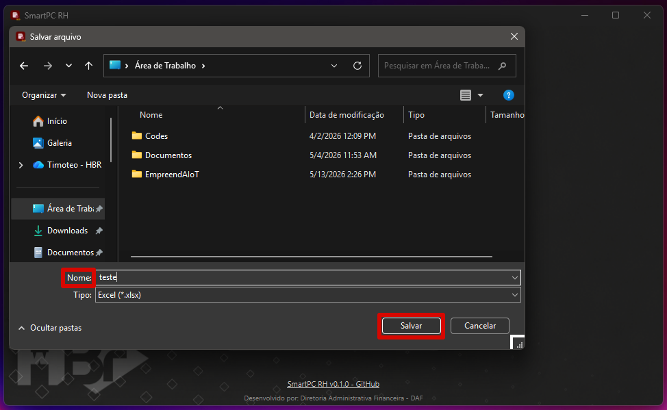

# SmartPC RH

Programa de criação de planilhas de Prestação de Contas p/ o setor de RH do Instituto Hardware BR - HBR.

## 1. Requisitos

Para uso adequado do programa, o usuário deve possuir:

- Sistema Operacional: Windows 10 ou 11

Para uso da funcionalidade `Abrir planilha quando estiver pronta`, é recomendado que o usuário possua o *Microsoft Excel* instalado na versão mais recente.

## 2. Guia de Uso

### 2.1 Baixando e Instalando o Programa

Para usar o `SmartPC RH`, primeiro, você deve baixar o arquivo `.exe` disponível [aqui](https://github.com/imbaTIMvel/smartpc_rh/releases). Procure pela versão mais recente (*Latest*) e clique no arquivo `.exe` para fazer o download.

> [!Warning]
> Caso você ainda tenha o executável de uma versão antiga do programa, recomenda-se excluí-lo.

Baixado o programa, você pode colocar o arquivo `.exe` onde achar melhor.

### 2.2 Abrindo o Programa

Feito isso, clique no arquivo `.exe` para abrir o programa.

> [!Warning]
> É possível que o *Windows Defender* acuse o programa como "software perigoso". Neste caso, para executá-lo, você deve clicar em `Mais Informações` e, depois, no botão `Executar assim mesmo`.

### 2.3 Interface do Programa

#### 2.3.1 Campos de Arquivos

O programa possui um único campo para a inserção do arquivo (planilha Excel) de entrada. No caso:

| Campo         | Extensões de arquivo aceitas | Padronização do arquivo                                           | Aceita mais de um arquivo? |
| ------------- | ---------------------------- | ----------------------------------------------------------------- | -------------------------- |
| Relatório     | .xlsx                        | Relatório de Pagamentos e/ou Recebimentos, retirados do Octalink  | Não                        |

Para este campo, há dois botões: `Selecionar` e `Remover`. Ao clicar em `Selecionar`, o programa abre um diálogo do *Explorador de Arquivos*, permitindo que o usuário selecione o arquivo Excel que deseja inserir.

Após selecionar o arquivo, o campo de arquivo inserido é atualizado.

Ao clicar em `Remover`, se houver um arquivo selecionado, o programa vai removê-lo, deixando o campo vazio.

#### 2.3.2 Demais Recursos

Além disso, o programa possui:
- `Título PC`: Uma **caixa de texto** para inserir o título da Prestação de Contas (PC) que será usado para especificar a Prestação de Contas nos respectivos campos da planilha de saída;
- `Abrir planilha quando estiver pronta`: Um **toggle switch** que permite que o usuário defina se a planilha de saída será aberta ou não após a execução do programa;
- `Gerar Planilha`: O botão que inicia a execução do programa.

### 2.4 Executando o Programa

Inserido o Relatório, ao clicar no botão `Gerar Planilha`, o programa deve gerar uma planilha de saída com duas abas: `Folha de Rosto` e `Detalhamento`, seguindo a formatação [template](assets/template/template.xlsx).

Para os campos da planilha de saída, o programa extrai todas as linhas do Relatório (planilha de entrada) marcadas como "FOLHA DE PAGAMENTO - BOLSISTAS" ou "FOLHA DE PAGAMENTO - ALUNOS BOLSISTAS" na coluna "Operação", fazendo as correspondências:

#### 2.4.1 Folha de Rosto

- `NF/ND`: Retirado da coluna "Nº NF" do Relatório do Octalink. Preenchido com "-" caso não haja informação a extrair;
- `Data de emissão da NF/ND`: Retirado da coluna "Emissão" do Relatório do Octalink;
- `Mês/Ano`: Retirado da coluna "Vencimento/Mov." do Relatório do Octalink, formatado como "mês/yy" (onde "yy" corresponde aos últimos 2 dígitos do ano);
- `Prestação de contas`: Texto inserido na caixa de texto "Título PC" do programa;
- `Data do pagamento`: Retirado da coluna "Vencimento/Mov." do Relatório do Octalink;
- `Valor`: Retirado da coluna "Valor Total" do Relatório do Octalink. Imediatamente abaixo da última célula preenchida, há uma célula com a soma dos itens.

#### 2.4.2 Detalhamento

- `Nome/Tipo de serviço`: Retirado da coluna "Razão Social" do Relatório do Octalink;
- `CNPJ/CPF`: Retirado da coluna "CPF/CNPJ" do Relatório do Octalink;
- `Valor`: Retirado da coluna "Valor Total" do Relatório do Octalink. Imediatamente abaixo da última célula preenchida, há uma célula com a soma dos itens.

## 3. Releases

### `v0.1.0` SmartPC RH (*beta release*)

> [!Warning]
> O lançamento beta (*beta release*) foi desenvolvido para testes internos, visando identificar e corrigir bugs antes do lançamento de uma versão estável.

Data de lançamento: `28/05/2026`

Para fazer o download desta versão, clique [aqui](https://github.com/imbaTIMvel/smartpc_rh/releases/download/v0.1.0/SmartPC_RH.exe).

*Release* inicial do programa de criação de planilhas de Prestação de Contas p/ o setor de RH do Instituto Hardware BR - HBR.

**Features:**
- Compatível com planilhas Excel, do tipo:
  - `Relatório`: Relatório de Pagamentos ou de Recebimentos, conforme exportados pelo Octalink, no formato .xlsx;
- Lê os dados do Relatório e os organiza em uma nova planilha com duas abas: `Folha de Rosto` e `Detalhamento`, conforme o padrão utilizado pelo setor de RH (ver [template](assets/template/template.xlsx)).
- Permite que o usuário escolha o diretório de salvamento para a planilha (.xlsx) de saída.

Clique [aqui](https://github.com/imbaTIMvel/smartpc_rh/releases) para acessar o **changelog completo**.

## 4. Desenvolvimento

**Autor:**

Timóteo Altoé (*handle*: [imbaTIMvel](github.com/imbaTIMvel))

**Datas:**

`19/05/2026` Início do projeto

`21/05/2026` Lançamento da versão *alfa* - para testes internos

`26/05/2026` Publicação da primeira versão oficial no GitHub

`28/05/2026` Lançamento da versão *beta* - para testes
